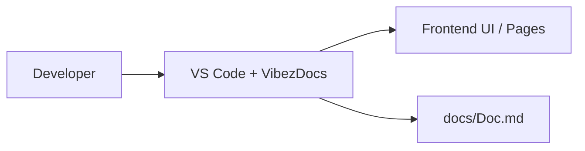

# VibezDocs

## Architecture
- backend component activity detected in Refer/QuizServer.java
- backend unknown activity detected in test/run-quiz-test.ps1
- Updated the run-quiz-test.ps1 script in the test directory with 2 new changes.
- The updated script now sets up a quiz server with a single question and client input, using Java to compile and run the quiz se...

## APIs
- (none yet)

## Components
- Component update in Refer/QuizServer.java: package ServerClient;

## Database
- (none yet)

## Pages
- (none yet)

## Development Timeline
- 2026-03-31T18:31:59.635Z: Updated in Refer/QuizServer.java (component)
- 2026-03-31T18:58:43.180Z: Updated in test/run-quiz-test.ps1 (unknown)

## C4 Diagram (Mermaid format)

